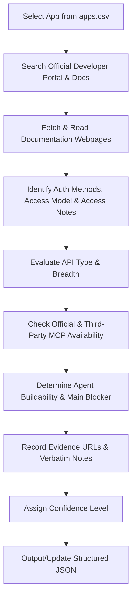

# App Research Skill

This skill provides a systematic, grounded workflow for researching and evaluating applications listed in `apps.csv` for AI Agent buildability and integration readiness.

---

## 1. Objective & Core Principles

The primary objective is to perform rigorous, grounded research on 100 applications to determine how suitable and accessible each application is for AI Agent integration.

### Core Research Rules
1. **Zero Hallucination / No Unverified Knowledge**: Do NOT rely on general memory or assumptions. Every claim must be verified against live documentation.
2. **Official Documentation First**:
   - **API & Docs**: Prefer official developer portals (e.g., `developer.x.com`, `docs.x.com`).
   - **Authentication**: Prefer official authentication guides (e.g., OAuth 2.0 specs, API key management guides).
   - **Pricing & Access**: Prefer official pricing pages, terms of service, and enterprise plan documentation.
   - **MCP Servers**: Prefer official Anthropic MCP registry, official GitHub repositories, or documented third-party MCP servers (e.g., Composio, Smithery).
3. **No Search-Snippet Evidence**: Never quote or rely on Google/Bing search snippets as evidence. You must fetch and read the actual destination web page content.
4. **No Assumptions on Access**:
   - An API existing does NOT mean it is `self-serve`.
   - An API existing does NOT mean the app is `READY` for agent buildability.
   - Always verify if API access requires a paid tier, enterprise plan, partner approval, or admin consent.
5. **Mandatory Evidence Logging**: Every key classification (API availability, access model, agent buildability, auth method) MUST be supported by direct evidence URLs and concrete evidence notes.
6. **Explicit Confidence & Handling Unknowns**:
   - Never guess or fabricate missing parameters.
   - If documentation is ambiguous, partial, missing, or contradictory, explicitly record the value as `"Unknown"` (or `["Unknown"]`), mark `confidence` as `"medium"` or `"low"`, and document the research gap in `evidence_notes`.

---

## 2. Research Data Schema & Field Definitions

For every application in `apps.csv`, gather and record the following 15 core fields:

| # | Field Name | Type | Allowed Values / Format | Description & Criteria |
|---|---|---|---|---|
| 1 | `category` | String | Operational category matching `apps.csv` | The high-level operational domain of the app. |
| 2 | `description` | String | Free-form text (1 sentence) | Concise one-line description of the app's core functionality. |
| 3 | `auth_methods` | Array of Strings | `OAuth 2.0`, `API Key`, `Personal Access Token`, `Basic Auth`, `JWT`, `Session Cookie`, `SAML/SSO`, `None`, `Unavailable`, `Unknown` | List of supported authentication methods for programmatic API/tool access. If unknown after research, use `["Unknown"]`. |
| 4 | `access_model` | Enum | `self-serve`, `trial`, `paid`, `admin approval`, `partner/contact-sales`, `enterprise-only`, `unavailable`, `unknown` | The primary access barrier for developer API access: <br>• `self-serve`: Free or instant self-service API key/OAuth creation.<br>• `trial`: Available during a free trial period.<br>• `paid`: Requires a standard paid subscription.<br>• `admin approval`: Requires workspace/tenant admin permission.<br>• `partner/contact-sales`: Requires joining a partner program or contacting sales.<br>• `enterprise-only`: Restricted exclusively to enterprise plan tiers.<br>• `unavailable`: No developer access model exists.<br>• `unknown`: Cannot be determined conclusively. |
| 5 | `access_notes` | String | Free-form text | Explanatory nuance capturing distinctions such as free developer org vs paid production, sandbox vs commercial trial, admin permission requirements, OAuth review gates, or enterprise restrictions. |
| 6 | `api_available` | Boolean / String | `true`, `false`, `unknown` | Whether a public developer API or programmatic interface exists. |
| 7 | `api_type` | Array of Enums | `REST`, `GraphQL`, `SOAP`, `SDK`, `CLI`, `other`, `none`, `unknown` | Protocol or architecture of the available developer API/tools. |
| 8 | `api_breadth` | Enum | `broad`, `moderate`, `narrow`, `read-only`, `action-limited`, `none`, `unknown` | Scope of API capability: <br>• `broad`: Full CRUD + webhooks across almost all core entities.<br>• `moderate`: Covers major entities with standard read/write abilities.<br>• `narrow`: Limited to very specific niche endpoints (e.g., search only).<br>• `read-only`: Purely data extraction/fetching, no mutation endpoints.<br>• `action-limited`: Mutating capabilities heavily constrained or gated.<br>• `none`: No API.<br>• `unknown`: Scope cannot be determined. |
| 9 | `mcp_official` | Boolean / String | `true`, `false`, `unknown` | Availability of an official Model Context Protocol (MCP) server maintained by the product team. |
| 10 | `mcp_third_party` | Boolean / String | `true`, `false`, `unknown` | Availability of third-party MCP implementations (e.g., Composio, Smithery, community GitHub repos). |
| 11 | `agent_buildability` | Enum | `READY`, `CONDITIONAL`, `BLOCKED` | Overall assessment of developer feasibility for AI Agent automation (see definitions below). |
| 12 | `main_blocker` | String | Free-form text (`"None"` if READY) | Clear statement of the primary obstacle if buildability is `CONDITIONAL` or `BLOCKED`. |
| 13 | `evidence_urls` | Array of Strings | Direct URLs | Valid, direct URLs to official documentation pages validating the findings. |
| 14 | `evidence_notes` | String | Bullet points / concise summary | Verbatim facts, quotes, or key takeaways extracted directly from the evidence URLs. If findings are unclear, document what was checked. |
| 15 | `confidence` | Enum | `high`, `medium`, `low` | Confidence rating based on documentation clarity and directness. Must be `medium` or `low` if any critical field is unknown or ambiguous. |

---

## 3. Agent Buildability Classification Framework

Use the following strict rules to determine `agent_buildability`:

### 🟢 `READY`
- **Definition**: A normal developer can obtain the necessary access and use meaningful functionality through an API/tool interface without a major external gate.
- **Criteria**:
  - Public API is self-serve or available on standard free/affordable plans.
  - Authentication (OAuth 2.0, API key, PAT) can be set up independently without manual vendor review or partner application.
  - Endpoints support essential action execution (mutations/writes), not just read-only.
  - Main blocker is `"None"`.

### 🟡 `CONDITIONAL`
- **Definition**: The integration is technically feasible but requires something such as paid access, OAuth app review, admin approval, enterprise access, partner approval, restricted scopes, or another meaningful gate.
- **Criteria**:
  - API exists, but access requires:
    - Paid subscription or enterprise plan requirement.
    - Workspace/Tenant Admin approval or consent.
    - Vendor OAuth app verification/review process before production access.
    - Official partner program approval (e.g., financial institution partner review, security vetting).
    - Restricted scope limitations or action-limited endpoints.
- **Main Blocker Examples**: `"Requires paid plan"`, `"Requires workspace admin consent"`, `"OAuth production app verification required"`, `"REST API only available on Enterprise tier"`.

### 🔴 `BLOCKED`
- **Definition**: The necessary access or functionality is not realistically available to a normal developer.
- **Criteria**:
  - No public API exists.
  - API access is strictly closed to external developers or requires bespoke enterprise sales contracts ($10k+).
  - API is read-only when full write/action automation is required, or vital actions cannot be performed programmatically.
  - Product is deprecated, sunsetted, or entirely locked behind non-standard reverse-engineering/unsupported scraping.
- **Main Blocker Examples**: `"No public API or SDK available"`, `"Private API restricted strictly to strategic partners"`, `"No programmatic auth or export options"`.

---

## 4. Grounded Research Execution Workflow

When processing apps from `apps.csv`, follow this execution pipeline:



### Research Tools & Tactics
1. **Developer Portal Search**: Use `search_web` with queries like `<App Name> developer documentation API`, `<App Name> API key OAuth authentication`, `<App Name> pricing API access`, `<App Name> MCP server`.
2. **Read Content**: Use `read_url_content` or `read_browser_page` on official developer sites (`docs.<app>.com`, `<app>.dev`, `developer.<app>.com`).
3. **MCP Verification**: Check Anthropic official MCP repo lists, Composio integrations index, Smithery, or official GitHub repositories for the application.
4. **Never Guess**: If documentation cannot be retrieved or is unclear, flag `confidence` as `medium` or `low` and explain the exact ambiguity in `evidence_notes`.

---

## 5. Output JSON Format Specification

The research output must be written as a valid, structured JSON file (e.g., `apps_research_results.json`).

### Generic Placeholder Example (Schema Template)
```json
[
  {
    "id": 0,
    "app": "ExampleCRM",
    "category": "CRM and Sales",
    "description": "An example customer relationship management platform used for demonstrating the research schema.",
    "auth_methods": [
      "OAuth 2.0",
      "API Key"
    ],
    "access_model": "self-serve",
    "access_notes": "Self-serve API keys available on free tier. Advanced webhooks require standard paid subscription.",
    "api_available": true,
    "api_type": [
      "REST"
    ],
    "api_breadth": "broad",
    "mcp_official": false,
    "mcp_third_party": true,
    "agent_buildability": "READY",
    "main_blocker": "None",
    "evidence_urls": [
      "https://developer.examplecrm.com/docs/api-reference",
      "https://examplecrm.com/pricing"
    ],
    "evidence_notes": "ExampleCRM provides a self-serve REST API accessible with API Keys and OAuth 2.0 on standard plans.",
    "confidence": "high"
  }
]
```

---

## 6. Checklist & Validation Rules

Before finalizing any app research entry, verify:
- [ ] Is `category` consistent with `apps.csv` or accurate to the domain?
- [ ] Are `auth_methods` specified based on official docs?
- [ ] Is `access_model` matched correctly to official pricing/doc requirements?
- [ ] Are `access_notes` provided detailing developer vs production nuances?
- [ ] Is `api_available` verified (true/false/unknown)?
- [ ] Is `agent_buildability` set strictly according to `READY`, `CONDITIONAL`, or `BLOCKED` definitions?
- [ ] Is `main_blocker` set to `"None"` for `READY` apps, or clearly explained for `CONDITIONAL`/`BLOCKED` apps?
- [ ] Are all `evidence_urls` direct links to official documentation (no raw search result URLs)?
- [ ] Do `evidence_notes` summarize concrete statements from official documentation?
- [ ] If any parameter is uncertain, is `confidence` set to `medium` or `low` and the gap documented in `evidence_notes`?
- [ ] Is the output valid, well-formed JSON?
